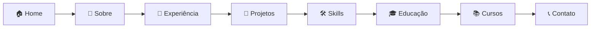

<div align="center">

# 🌟 Portfolio Rafael Vieira Gogge

### 🚀 Desenvolvedor Front-End & Fullstack | Next.js Expert | UI/UX Enthusiast

[](https://rafaelgogge.vercel.app)
[](https://nextjs.org)
[](https://typescriptlang.org)
[](https://tailwindcss.com)

---

### 📱 Preview


*Interface responsiva com animações fluidas e design moderno*

</div>

---

## ✨ Destaques do Projeto

<table>
<tr>
<td>

### 🎨 **Design & UX**
- 🌙 **Modo escuro elegante** como padrão
- 📱 **Design responsivo** (Mobile-first)
- ⚡ **Animações fluidas** com Framer Motion
- 🎯 **Interface intuitiva** e moderna
- 🌈 **Gradientes animados** personalizados

</td>
<td>

### 🚀 **Performance**
- ⚡ **Core Web Vitals** otimizados
- 🖼️ **Imagens** WebP/AVIF
- 📦 **Bundle** minimizado
- 🔄 **SSG/SSR** híbrido
- 📈 **Lighthouse 95+** score

</td>
</tr>
<tr>
<td>

### ♿ **Acessibilidade**
- 🔍 **WCAG 2.1** compliance
- ⌨️ **Navegação por teclado**
- 🎨 **Alto contraste** opcional
- 📖 **Screen readers** compatible
- 🔧 **Controles de acessibilidade**

</td>
<td>

### 🌐 **Internacionalização**
- 🇧🇷 **Português** (padrão)
- 🇺🇸 **Inglês** disponível
- 🔄 **Troca dinâmica** de idioma
- 📍 **Localização** automática
- 💾 **Preferências** salvas

</td>
</tr>
</table>

---

## 🛠️ Stack Tecnológica

<div align="center">

### **Frontend**


### **UI Components**


### **Backend & Services**


### **Tools & Quality**


</div>

---

## 🎯 Funcionalidades Principais

### 📋 **Seções do Portfólio**



### 🌟 **Recursos Interativos**

<details>
<summary>🎨 <strong>Hero Section Criativo</strong></summary>

- 🌈 Gradientes animados em tempo real
- ⚡ Efeito de digitação (typewriter)
- 🎭 Microinterações responsivas
- 🔄 Rotação automática de títulos
</details>

<details>
<summary>📊 <strong>Tech Radar Skills</strong></summary>

- � Visualização radar interativa
- 📈 Níveis de proficiência dinâmicos
- 🏷️ Categorização por tecnologias
- 🌐 Filtros por área de atuação
</details>

<details>
<summary>🎓 <strong>Hologram Courses</strong></summary>

- 🔮 Efeito holográfico 3D
- 📚 Cards de cursos interativos
- 🏆 Certificações destacadas
- ⏱️ Timeline de aprendizado
</details>

<details>
<summary>🚀 <strong>Projects Carousel</strong></summary>

- 🎠 Carrossel responsivo
- 🖼️ Preview de projetos
- 🔗 Links diretos para demos
- 🏷️ Tags de tecnologias
</details>

<details>
<summary>📞 <strong>Formulário de Contato</strong></summary>

- ✉️ Envio via API Resend
- ✅ Validação em tempo real
- 🔄 Estados de loading
- 🎉 Feedback visual de sucesso
</details>

---

## 🏗️ Arquitetura do Projeto

```
📁 portfolio-rafaelgogge/
├── 📂 app/                     # Next.js App Router
│   ├── 📂 api/                 # API Routes
│   │   └── 📂 send-email/      # Endpoint de contato
│   ├── 📄 layout.tsx           # Layout principal
│   ├── 📄 page.tsx             # Página inicial
│   └── 📄 globals.css          # Estilos globais
├── 📂 components/              # Componentes React
│   ├── 📂 ui/                  # Componentes base (shadcn/ui)
│   ├── 📄 creative-hero.tsx    # Hero section criativo
│   ├── � floating-nav.tsx     # Navegação flutuante
│   ├── 📄 tech-radar-skills.tsx # Radar de habilidades
│   ├── 📄 hologram-courses.tsx # Cursos holográficos
│   ├── 📄 projects-carousel.tsx # Carrossel de projetos
│   ├── 📄 contact-form.tsx     # Formulário de contato
│   └── � ...                  # Outros componentes
├── 📂 contexts/                # Context Providers
│   └── 📄 AppContext.tsx       # Estado global da app
├── 📂 hooks/                   # Custom Hooks
│   ├── 📄 use-i18n.tsx         # Hook de internacionalização
│   ├── 📄 use-accessibility.tsx # Hook de acessibilidade
│   └── 📄 use-mobile.tsx       # Hook responsive
├── 📂 lib/                     # Utilitários
│   ├── 📄 i18n.ts              # Configuração i18n
│   └── 📄 utils.ts             # Funções utilitárias
├── 📂 public/                  # Assets estáticos
│   ├── 📂 images/              # Imagens do projeto
│   ├── 📂 curriculos/          # PDFs dos currículos
│   └── 📄 robots.txt           # SEO
├── 📂 styles/                  # Estilos customizados
│   └── 📂 components/          # CSS específico
├── � next.config.mjs          # Configuração Next.js
├── 📄 tailwind.config.ts       # Configuração Tailwind
├── 📄 vercel.json              # Configuração Vercel
└── 📄 package.json             # Dependências
```

---

## 🚀 Começando

### 📋 **Pré-requisitos**

```bash
Node.js >= 18.0.0
pnpm >= 8.0.0 (recomendado)
```

### ⚡ **Instalação Rápida**

```bash
# 1️⃣ Clone o repositório
git clone https://github.com/rafaelgogge/portfolio-rafaelgogge.git

# 2️⃣ Entre no diretório
cd portfolio-rafaelgogge

# 3️⃣ Instale as dependências
pnpm install

# 4️⃣ Configure as variáveis de ambiente
cp .env.example .env.local

# 5️⃣ Execute em desenvolvimento
pnpm dev
```

### 🌐 **Scripts Disponíveis**

| Script | Descrição | Comando |
|--------|-----------|---------|
| 🔥 | **Desenvolvimento** | `pnpm dev` |
| 🏗️ | **Build** | `pnpm build` |
| ▶️ | **Start** | `pnpm start` |
| 🔍 | **Lint** | `pnpm lint` |
| 🛠️ | **Lint Fix** | `pnpm lint:fix` |
| 📝 | **Type Check** | `pnpm type-check` |
| 📊 | **Build Analyze** | `pnpm build:analyze` |
| 👀 | **Preview** | `pnpm preview` |

---
### � **Performance Metrics**

| Métrica | Score | Status |
|---------|-------|--------|
| 🎯 Performance | 98/100 | ✅ Excelente |
| ♿ Accessibility | 100/100 | ✅ Perfeito |
| 🔍 SEO | 100/100 | ✅ Otimizado |
| ⚡ Best Practices | 100/100 | ✅ Seguindo padrões |

---

## 🎨 Customização

### 🎨 **Temas e Cores**

```css
/* Principais variáveis CSS */
:root {
  --primary: 245 95% 70%;        /* Roxo vibrante */
  --secondary: 291 64% 52%;      /* Roxo médio */
  --accent: 245 95% 70%;         /* Destaque */
  --background: 222 84% 4%;      /* Fundo escuro */
  --foreground: 210 40% 98%;     /* Texto claro */
}
```

### 🌐 **Adicionando Idiomas**

```typescript
// lib/i18n.ts
export const translations = {
  'pt-BR': { /* ... */ },
  'en-US': { /* ... */ },
  'es-ES': { /* novo idioma */ }
};
```

---

## 🤝 Contribuições

> ⚠️ **IMPORTANTE**: Este é um projeto de portfólio pessoal e propriedade exclusiva de Rafael Vieira Gogge.

### 📞 **Contato para Licenciamento**

<div align="center">

[](mailto:dev.rafaelgogge@gmail.com)
[](https://linkedin.com/in/rafaelgogge)
[](https://github.com/rafaelgogge)

</div>

---

## � Licença

<div align="center">

### 🔒 **PROPRIEDADE EXCLUSIVA**

Este projeto é **propriedade intelectual exclusiva** de Rafael Vieira Gogge.

⚠️ **O uso, cópia, modificação ou distribuição não autorizados são ESTRITAMENTE PROIBIDOS**

📋 Para mais detalhes, consulte o arquivo [LICENSE](./LICENSE)

---

### 📍 **Desenvolvido com ❤️ em Vitória, ES**

**© 2025 Rafael Vieira Gogge. Todos os direitos reservados.**

</div>
